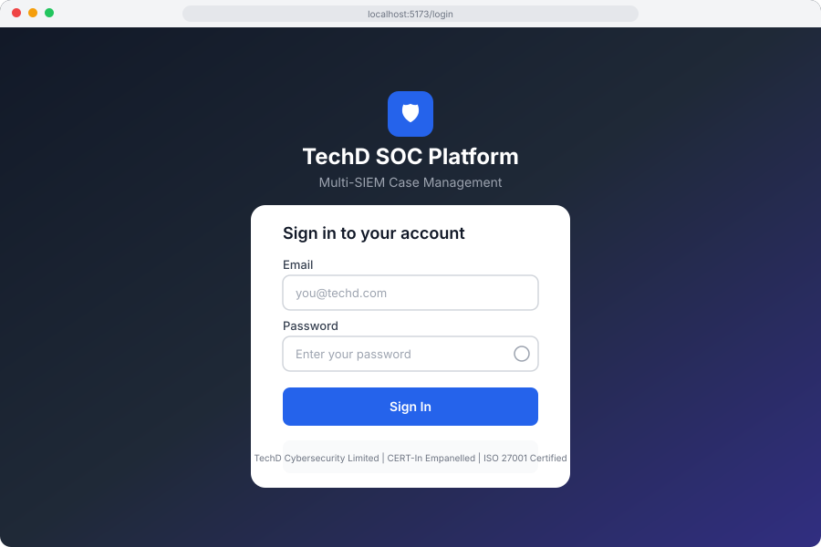
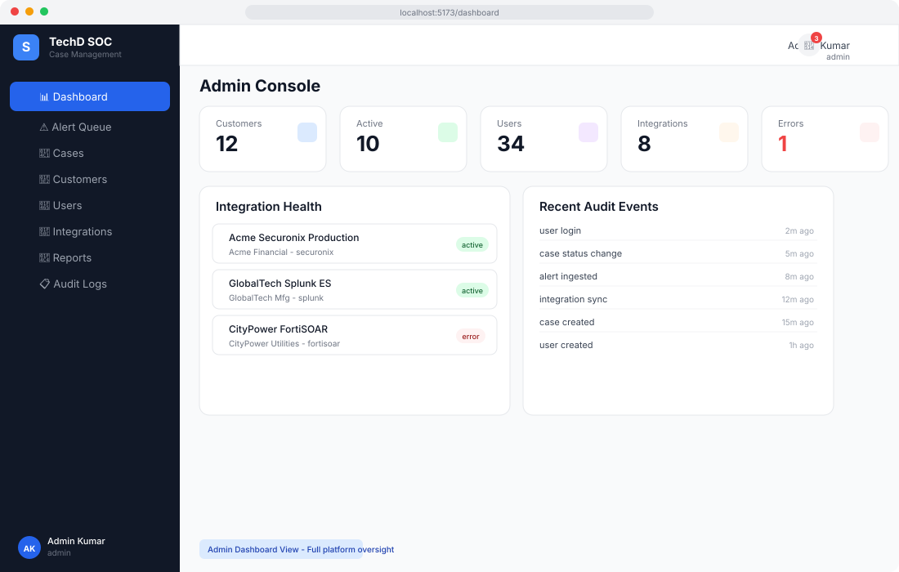
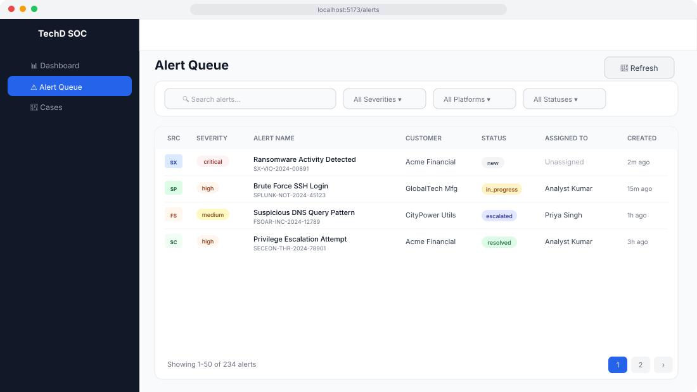
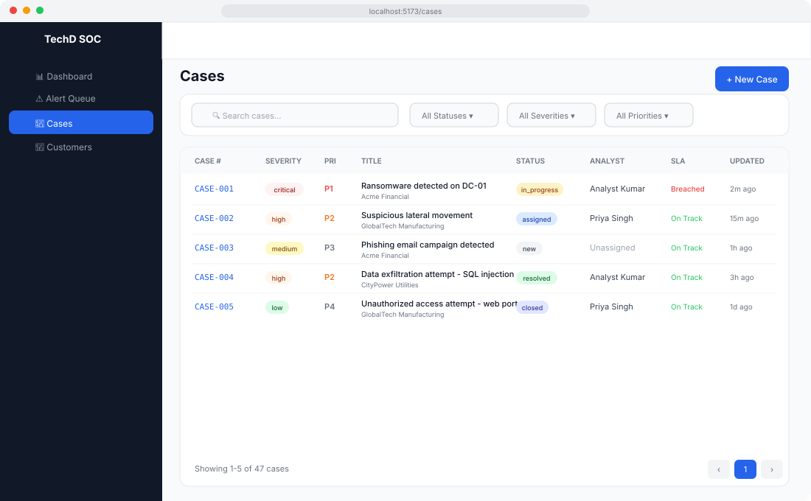
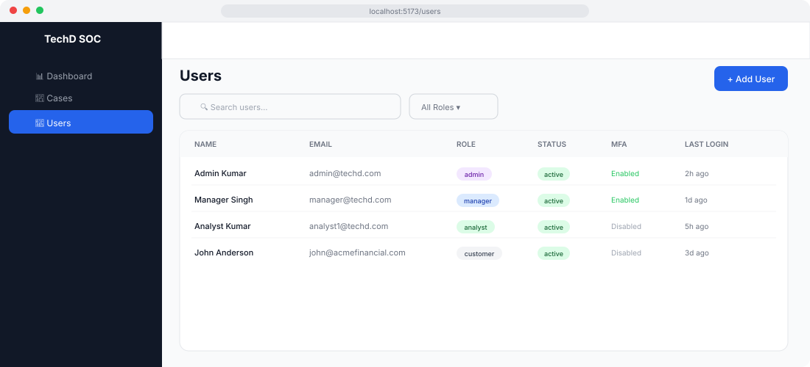
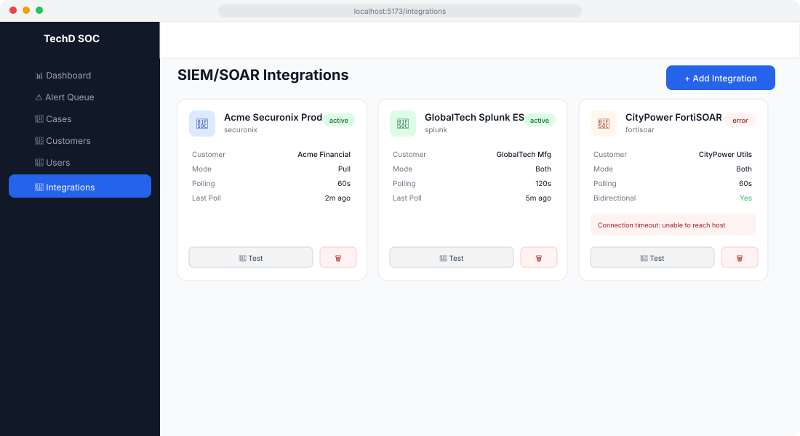
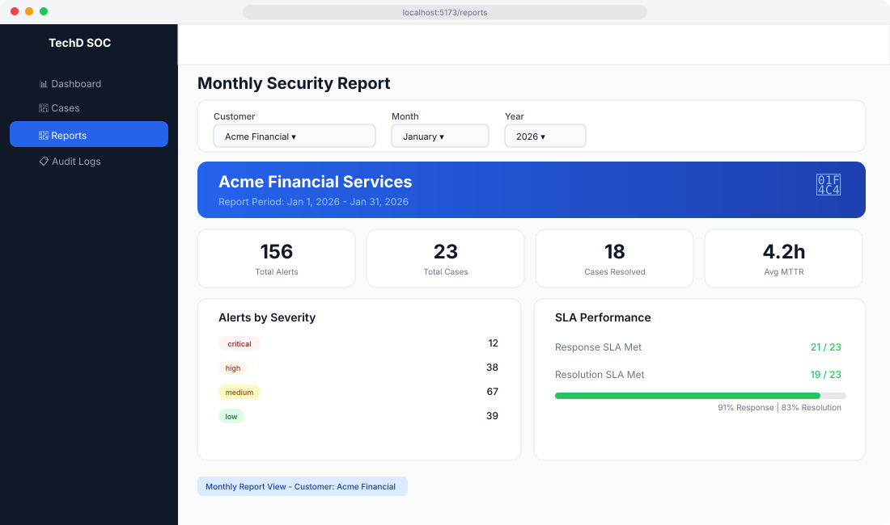

# User Guide

## TechD SOC Case Management Platform

Complete walkthrough of all platform features with screenshot references for each page.

---

## Table of Contents

1. [Logging In](#logging-in)
2. [Dashboard Overview](#dashboard-overview)
3. [Alert Queue Management](#alert-queue-management)
4. [Case Lifecycle Management](#case-lifecycle-management)
5. [Customer Management](#customer-management)
6. [User Administration](#user-administration)
7. [SIEM/SOAR Integrations](#siemsoar-integrations)
8. [Reports & Analytics](#reports--analytics)
9. [Audit Logs](#audit-logs)
10. [Role-Based Access Guide](#role-based-access-guide)

---

## Logging In

### Login Page

Navigate to `http://localhost:5173` (development) or your production URL. You'll see the login screen.



**Steps:**
1. Enter your **email address** (e.g., `admin@techd.com`)
2. Enter your **password**
3. Click the **eye icon** to toggle password visibility
4. Click **Sign In**

**Default Credentials (Development):**

| Role | Email | Password |
|------|-------|----------|
| Admin | admin@techd.com | SecureP@ss123 |
| Manager | manager@techd.com | SecureP@ss123 |
| Analyst | analyst1@techd.com | SecureP@ss123 |
| Customer | john@acmefinancial.com | SecureP@ss123 |

### Multi-Factor Authentication (MFA)

If MFA is enabled on your account, after entering your password you'll be prompted for a 6-digit TOTP code from your authenticator app (Google Authenticator, Microsoft Authenticator, Authy, etc.).

### Session Management

- **Access tokens** expire after 15 minutes and are automatically refreshed
- **Refresh tokens** last 7 days before requiring re-login
- Click the **logout icon** (top-right) to end your session

---

## Dashboard Overview

After logging in, you're directed to a role-adaptive dashboard that shows different information based on your role.



### Admin Console

Visible to: **Admin** users

The Admin Console provides platform-wide oversight:

- **Stats Cards** (top row):
  - Total Customers count
  - Active Customers count
  - Total Users count
  - Active Integrations count
  - Integration Errors count (highlighted in red)

- **Integration Health** (left panel):
  - Lists all SIEM/SOAR integrations
  - Shows status: `active` (green), `error` (red), `inactive` (gray)
  - Displays customer and platform type for each

- **Recent Audit Events** (right panel):
  - Last 10 platform events with relative timestamps
  - Includes logins, case changes, alert ingestion, etc.

### Manager Overview

Visible to: **Manager** users

- **SLA Compliance** percentage across all managed customers
- **MTTR** (Mean Time to Resolution) metric
- **Active Analysts** count with workload distribution
- **Customers** managed count
- **Alert Volume Chart** - 30-day bar chart trend
- **Cases by Severity** - Pie chart breakdown
- **Analyst Workload** - Progress bars per analyst
- **Customer Summary** - Open cases and SLA breaches per customer

### Analyst Workbench

Visible to: **Analyst** users

- **My Open Cases** count
- **Critical Cases** count
- **New Alerts** requiring attention
- **Unassigned Alerts** in the queue
- **My Active Cases** list with severity, status, and SLA indicators

### Customer Portal

Visible to: **Customer** users

- **Total Cases** for their organization
- **Open Cases** count
- **Resolved Cases** count
- **Critical Open** cases count
- **Recent Cases** list with click-through to case detail

---

## Alert Queue Management

The Alert Queue is the central hub for triaging incoming security alerts from all connected SIEM/SOAR platforms.

Visible to: **Analyst**, **Manager**, **Admin**



### Alert Queue Features

#### Source Platform Icons

Each alert shows its source platform with a badge:
- **SX** = Securonix SNYPR
- **SC** = Seceon aiSIEM
- **SP** = Splunk Enterprise Security
- **FS** = FortiSOAR

#### Filtering Alerts

Use the filter bar at the top to narrow results:

1. **Search** - Free-text search across alert names and IDs
2. **Severity** - Filter by: Critical, High, Medium, Low
3. **Platform** - Filter by: Securonix, Seceon, Splunk, FortiSOAR, Manual
4. **Status** - Filter by: New, In Progress, Escalated, Resolved, False Positive

#### Refresh

Click the **Refresh** button to pull the latest alerts without a full page reload.

#### Alert Actions

Click on any alert row to view its full detail, which includes:
- Complete alert metadata from the source SIEM
- MITRE ATT&CK technique tags (when available)
- Source alert ID for cross-referencing
- Assign to analyst
- Update status
- Create a case from the alert

#### Alert Statuses

| Status | Description |
|--------|-------------|
| `new` | Just ingested, not yet triaged |
| `in_progress` | Being actively investigated |
| `escalated` | Escalated to a manager or senior analyst |
| `resolved` | Investigation complete, no further action |
| `false_positive` | Determined to be benign |

---

## Case Lifecycle Management

Cases are the core work items in the platform, representing security incidents that require investigation and resolution.

Visible to: **All roles** (with varying permissions)



### Case List

The cases page shows a filterable, paginated table with:

- **Case #** - Auto-generated case number (e.g., `CASE-001`)
- **Severity** - Critical (red), High (orange), Medium (yellow), Low (green)
- **Priority** - P1 (critical), P2 (high), P3 (medium), P4 (low)
- **Title** - Case title with customer name below
- **Status** - Current lifecycle state
- **Analyst** - Assigned analyst or "Unassigned"
- **SLA** - "On Track" (green) or "Breached" (red)
- **Updated** - Relative timestamp

### Creating a New Case

1. Click **+ New Case** (top-right)
2. Fill in the modal form:
   - **Customer** - Select from dropdown
   - **Title** - Descriptive case title
   - **Description** - Detailed incident description
   - **Severity** - Critical, High, Medium, Low
   - **Priority** - P1, P2, P3, P4
   - **Type** - Incident, Investigation, Service Request, False Positive
3. Click **Create Case**

### Case Lifecycle States

```
New → Assigned → In Progress → Resolved → Closed
                     ↓
              Pending Customer
                     ↓
               Escalated
```

| State | Description |
|-------|-------------|
| `new` | Case created, pending assignment |
| `assigned` | Assigned to an analyst |
| `in_progress` | Analyst actively investigating |
| `pending_customer` | Awaiting customer input/approval |
| `escalated` | Escalated to manager/senior analyst |
| `resolved` | Investigation complete, pending closure |
| `closed` | Fully resolved and closed |

### Case Detail View

Click any case row to view the full case detail page with:

- **Case Timeline** - Chronological activity log
- **Comments** - Discussion thread with markdown support
- **Attachments** - File uploads (evidence, screenshots)
- **Linked Alerts** - Source alerts that triggered the case
- **SLA Countdown** - Response and resolution time remaining
- **Actions** - Assign, escalate, resolve, close

### SLA Indicators

Cases are tracked against customer-specific SLA policies:
- **On Track** (green) - Within SLA targets
- **Breached** (red) - SLA target exceeded

SLA breaches trigger automatic notifications to the assigned analyst, their manager, and the admin team.

---

## Customer Management

Multi-tenant customer organization management.

Visible to: **Manager** (view), **Admin** (full CRUD)

### Customer List

The customer list shows:
- **Code** - Unique customer identifier (e.g., `ACME001`)
- **Name** - Full organization name
- **Industry** - BFSI, Manufacturing, Critical Infrastructure, etc.
- **Contact** - Primary contact name and email
- **Status** - Active, Suspended, Inactive

### Adding a New Customer (Admin only)

1. Click **+ Add Customer**
2. Fill in the form:
   - **Name** and **Code** (required)
   - **Industry** (dropdown)
   - **Contact Name** and **Contact Email**
3. Click **Create Customer**

### Customer Data Isolation

Each customer's data is isolated using PostgreSQL Row-Level Security (RLS). Users only see data for customers they are assigned to.

---

## User Administration

Platform user management with RBAC roles.

Visible to: **Admin** only



### User List

The user table displays:
- **Name** - First and last name
- **Email** - Login email address
- **Role** - Color-coded role badge (Admin=purple, Manager=blue, Analyst=green, Customer=gray)
- **Status** - Active (green) or Inactive (red)
- **MFA** - Enabled (green) or Disabled (gray)
- **Last Login** - Timestamp or "Never"

### Adding a New User

1. Click **+ Add User**
2. Fill in the form:
   - **First Name** and **Last Name** (required)
   - **Email** (required, must be unique)
   - **Password** (required, minimum 8 characters)
   - **Role** (Analyst, Manager, Admin, Customer)
3. Click **Create User**

### Role Descriptions

| Role | Description | Access Level |
|------|-------------|-------------|
| **Admin** | Full platform administration | All features |
| **Manager** | Supervisory access, SLA management | Assigned customers |
| **Analyst** | Day-to-day case and alert management | Assigned customers |
| **Customer** | Read-only portal access | Own organization |

---

## SIEM/SOAR Integrations

Manage connections to external SIEM and SOAR platforms for alert ingestion and bidirectional sync.

Visible to: **Admin** only



### Integration Cards

Each integration is displayed as a card showing:
- **Platform badge** - Color-coded by platform type
- **Name** - Integration display name
- **Status** - Active (green), Error (red), Inactive (gray)
- **Customer** - Associated customer organization
- **Mode** - Pull (polling), Push (webhook), or Both
- **Polling Interval** - How frequently alerts are fetched
- **Last Poll** - When the last poll occurred
- **Bidirectional** - Whether changes sync back to the source
- **Error Message** - Displayed in red when status is `error`

### Adding a New Integration

1. Click **+ Add Integration**
2. Configure in the modal:
   - **Customer** - Which customer this integration belongs to
   - **Platform** - Securonix SNYPR, Seceon aiSIEM, Splunk ES, FortiSOAR
   - **Name** - Descriptive name
   - **Base URL** - API endpoint URL
   - **Auth Type** - Bearer Token, API Key, Basic Auth, OAuth 2.0
   - **Polling Interval** - Seconds between polls (minimum 30s)
   - **Mode** - Pull (polling), Push (webhook), Both
3. Click **Create Integration**

### Testing Connectivity

Click the **Test** button on any integration card to verify:
- API endpoint reachability
- Authentication validity
- Permission scope

### Deleting an Integration

Click the **trash icon** on the integration card. You'll be prompted to confirm before deletion.

### Supported Platforms

| Platform | Auth Methods | Ingestion Modes | Bidirectional |
|----------|-------------|-----------------|---------------|
| Securonix SNYPR | Bearer Token, JWT | Pull | No |
| Seceon aiSIEM | API Key | Pull | No |
| Splunk ES | Bearer Token | Pull + Push (HEC) | No |
| FortiSOAR | Basic, Bearer Token | Pull + Push | Yes |

---

## Reports & Analytics

Generate monthly security reports per customer with key metrics and visualizations.

Visible to: **Customer** (own org), **Manager** (assigned), **Admin** (all)



### Generating a Report

1. Select a **Customer** from the dropdown
2. Choose the **Month** (January - December)
3. Choose the **Year** (2024, 2025, 2026)
4. The report loads automatically

### Report Sections

#### Header Banner
- Customer name with branded gradient background
- Report period dates

#### Summary Cards
- **Total Alerts** - All alerts ingested during the period
- **Total Cases** - Cases created during the period
- **Cases Resolved** - Successfully resolved cases
- **Avg MTTR** - Mean Time to Resolution in hours

#### Alerts by Severity
- Breakdown of alerts by severity level (Critical, High, Medium, Low)
- Displayed with severity badges and counts

#### Alerts by Platform
- Bar chart showing alert distribution across SIEM/SOAR platforms
- Helps identify which platforms are generating the most alerts

#### SLA Performance
- **Response SLA Met** - Count of cases meeting response time SLA
- **Resolution SLA Met** - Count of cases meeting resolution time SLA
- Visual progress bar showing compliance percentage

#### Top Threat Categories
- Most common alert categories/types during the period
- Ranked by count

---

## Audit Logs

Immutable, append-only audit trail for all platform activities.

Visible to: **Manager** (view), **Admin** (view)

### Audit Log Features

- **Event Type Filter** - Filter by specific event types
- **Date Range Filter** - Start and end date selectors
- **Paginated Table** with columns:
  - Event Type (e.g., "user login", "case status change")
  - Actor (who performed the action)
  - Details (what changed)
  - IP Address
  - Timestamp

### Tracked Events

| Event Type | Description |
|-----------|-------------|
| `user_login` | User authentication events |
| `user_logout` | Session termination |
| `case_created` | New case creation |
| `case_status_change` | Case lifecycle transitions |
| `case_assigned` | Case assignment changes |
| `case_escalated` | Case escalation events |
| `case_closed` | Case closure |
| `alert_ingested` | New alert from SIEM |
| `alert_status_change` | Alert status updates |
| `integration_created` | New integration added |
| `integration_sync` | Integration polling events |
| `customer_created` | New customer onboarded |
| `user_created` | New user added |
| `sla_breach` | SLA target exceeded |

---

## Role-Based Access Guide

### What Each Role Can Do

#### Admin User
- Everything a Manager can do, plus:
- Manage all customers (create, edit, delete)
- Manage all users (create, edit, deactivate)
- Configure SIEM/SOAR integrations
- View platform-wide audit logs
- Access the Admin Console dashboard

#### Manager User
- View and manage cases for assigned customers
- Escalate and close cases
- View analyst workload and SLA metrics
- Generate reports for assigned customers
- View audit logs
- Access the Manager Overview dashboard

#### Analyst User
- View and triage alerts in the queue
- Create, update, and resolve cases
- Add comments and attachments to cases
- Assign alerts to themselves
- Access the Analyst Workbench dashboard

#### Customer User
- View cases for their organization (read-only)
- Add queries/comments to their cases
- Approve case closure
- View monthly security reports
- Access the Customer Portal dashboard

### Navigation Summary

| Page | URL | Admin | Manager | Analyst | Customer |
|------|-----|-------|---------|---------|----------|
| Dashboard | `/dashboard` | Admin Console | Manager Overview | Analyst Workbench | Customer Portal |
| Alert Queue | `/alerts` | Full | Full | Full | Hidden |
| Cases | `/cases` | Full | Full | Create/Update | View Only |
| Customers | `/customers` | Full CRUD | View | Hidden | Hidden |
| Users | `/users` | Full CRUD | Hidden | Hidden | Hidden |
| Integrations | `/integrations` | Full CRUD | Hidden | Hidden | Hidden |
| Reports | `/reports` | All | Assigned | Hidden | Own Org |
| Audit Logs | `/audit` | Full | View | Hidden | Hidden |

---

## Keyboard Shortcuts & Tips

- **Click any table row** to navigate to the detail view
- **Pagination** - Use the page navigation at the bottom of tables
- **Filters persist** while you navigate within a page
- **Notifications** - The bell icon shows unread count (auto-refreshes every 30s)
- **Responsive** - The sidebar collapses on mobile with a hamburger menu

---

## Getting Help

- For installation issues, see [Installation Guide](INSTALLATION.md)
- For configuration, see [Configuration Guide](CONFIGURATION.md)
- For API documentation, see the [README](../README.md#api-endpoints)
- Contact your platform administrator for access issues

---

## Screenshot Reference Index

| Screenshot | File | Description |
|-----------|------|-------------|
| Docker Services | [01-docker-services.svg](screenshots/01-docker-services.svg) | Docker Compose services running |
| Environment Config | [02-env-config.svg](screenshots/02-env-config.svg) | Backend .env file configuration |
| Database Migration | [03-db-migration.svg](screenshots/03-db-migration.svg) | Migration and seed output |
| Dev Servers | [04-dev-servers.svg](screenshots/04-dev-servers.svg) | Both servers running |
| Login Page | [05-login-page.svg](screenshots/05-login-page.svg) | Authentication screen |
| Admin Dashboard | [06-dashboard.svg](screenshots/06-dashboard.svg) | Admin Console dashboard |
| Cases Page | [07-cases-page.svg](screenshots/07-cases-page.svg) | Case management table |
| Integrations | [08-integrations-page.svg](screenshots/08-integrations-page.svg) | SIEM/SOAR connector cards |
| Alert Queue | [09-alerts-page.svg](screenshots/09-alerts-page.svg) | Alert triage table |
| Reports | [10-reports-page.svg](screenshots/10-reports-page.svg) | Monthly security report |
| Users | [11-users-page.svg](screenshots/11-users-page.svg) | User administration table |
